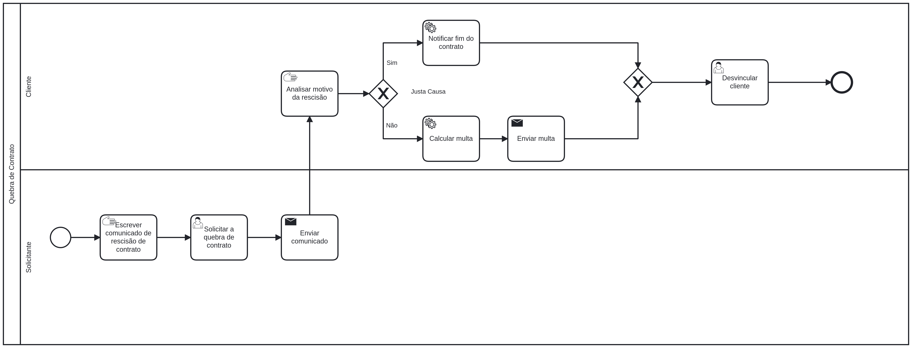

# StockPrime

**Yan Rodrigues Nalon, 1396722@sga.pucminas.br**

**Pedro Luiz Nato Silva, pedroluizns@hotmail.com**

**Victor Augusto Nascimento, 1401434@sga.pucminas.br**

**Guilherme da Silveira Cantoni, gcantoni@sga.pucminas.br**

**Carlos Emanuel Silva e Melo Oliveira, carlos.oliveira.1405439@sga.pucminas.br**

**André Rodrigues de Freitas Faria, 923006@sga.pucminas.br**

---

Professores:

**Cristiano Geraldo Teixeira Silva**

**Felipe Augusto Lima Reis**

**Hugo Bastos de Paula**

**Cleiton Silva Tavares**

---

_Curso de Engenharia de Software, Unidade Praça da Liberdade_

_Instituto de Informática e Ciências Exatas – Pontifícia Universidade de Minas Gerais (PUC MINAS), Belo Horizonte – MG – Brasil_

---

_**Resumo**. Escrever aqui o resumo. O resumo deve contextualizar rapidamente o trabalho, descrever seu objetivo e, ao final, 
mostrar algum resultado relevante do trabalho (até 10 linhas)._

---

## 1. Introdução

Em uma indústria onde é preciso gerenciar centenas de contratempos, imprevistos, lucros, perdas e transportes, concentrar toda a informação em um único lugar minimiza todas essas dificuldades. O StockPrime visa criar uma interface de controle de estoques que ajude corporações a terem um melhor gerenciamento de matérias-primas, projetando despesas e cruzando informações para maximizar o lucro. 

    1.1 Contextualização

A indústria do setor secundário enfrenta diariamente um número incontável de variáveis que afetam diferentes áreas do ramo, seja positivamente como negativamente. Portanto, centenas de corporações investem em sistemas de gerenciamento que visam otimizar os processos e controlar o fluxo de mercadorias nas entradas e saídas. A final, o monitoramento incorreto e não projetado pode ocasionar em prejuízos comerciais, como o sobrestoque ou a falta de insumos e por consequência a instabilidade econômica da corporação, colocando-a em uma situação de controle de danos.

    1.2 Problema

É comum casos onde empresas encontram dificuldades em controlar seus estoques, principalmente em situações onde essas empresas atuam tanto por meio de lojas físicas como por lojas virtuais - fato que vêm se tornando cada vez mais habitual devido ao avanço tecnológico e aumento da demanda da possibilidade de comprar online - , assim causando problemas devido à atualização de estoque em tempo real em relação à venda simultânea do mesmo produto por ambos meios digitais e físicos. 

    1.3 Objetivo geral

A StockPrime tem como objetivo geral facilitar controles de estoque, melhorar a gestão do inventário do usuário e intermediar relações com terceiros.

    1.3.1 Objetivos específicos

Gestão Econômica: Para minimizar custos e prejuizos, temos como objetivo o fornecimento constante de uma avaliação da situação financeira atual do cliente. Sendo assim, o usuário terá acesso à um resumo contendo seus custos, entradas, saídas, receitas e projeções de possíveis prejuízos.

Automatização de Restoque: A fim de melhorar a eficiência do processo de reestoque, a StockPrime visa intermediar as relações entre os fornecedores e os clientes. Dessa forma, o inventário sempre estará disponível para retirada de produtos e o reestoque mediante ao consumo do mesmo; 

Controle de Estoque: Registro de entradas e saídas de produtos no estoque do usuário. Tem como objetivo proporcionar um controle preciso da disponibilidade do conteúdo, catalogando entradas e saídas para fornecer uma gestão controlada.

    1.4 Justificativas

A ascensão econômica da corporação cliente é o foco principal da StockPrime. Sendo assim, uma gestão ecônomica que integra inúmeras variáveis em um só local e cria projeções de possiveis prejuizos compõem a combinação perfeita para a maximização do lucro corporativo. Não só isso como a gestão precisa do controle de estoque exerce uma função crucial na otimização da gestão do inventário, prevenindo a perda de investimentos com fornecimento desnecessário.

## 2. Participantes do processo

Os participantes do projeto são as empresas cujo não possuem um sistema de controle de estoque, a central de controle de estoque, fornecedores e transportadoras.

- Fornecedores

O fornecedor tem como função receber solicitações de reestoque e realizar todos os processos burocráticos para que um pedido seja enviado.

- Solicitante

Os solicitantes são os clientes da StockPrime que desejam adicionar, fazer retiradas ou reestocar o seu inventário.

- Transportadora

O trabalho da transportadora é levar o produto do fornecedor até o cliente, sendo responsável pela integridade do produto durante o percurso, disponibilizar recursos caso existam necessidades especiais no transporte e notificar os outros participantes a respeito de qualquer atualização no processo.

- Controle de Estoque

É a parte responsável pelas intermediações entre os outros participantes do processo e administrador da gestão de estoque.

## 3. Modelagem do processo de negócio

## 3.1. Análise da situação atual

Os atuais sistemas inteligentes que fazem a gestão de estoque utilizam da comunicação entre diversos setores para garantir o bom funcionamento dos processos, buscando maximizar a otimização. No entanto, existem ínviduos - majoritariamente pequenas empresas - que não vêem necessidades em automatizar o seu trabalho, portanto, realizam toda a administração manualmente. Consequentemente, os mesmos tornam-se suscetíveis a falhas catastróficas e prejuízos imensuráveis caso exista uma inconsistência ou um problema com o sistema.

## 3.2. Descrição Geral da proposta

A proposta da StockPrime é desenvolver um sistema que faça um gerenciamento eficaz de estoques, provendo acesso à gestão e acompanhamento em tempo real, automatização de reestoque, finanças e monitoramento de entradas e retiradas.

## 3.3. Modelagem dos Processos

### 3.3.1 Processo de Requisição e Formalização do Contrato

O processo de requisição e formalização do contrato garante que a Stockprime forneça o produto da forma correta e que o cliente não abuse das normas imposta pela nossa empresa. O subprocesso diz sobre os processos que devem seguir para verificar se o CNPJ é válido para o fechamento do contrato. 

### 3.3.2 Processo de Fornecimento

O processo de fornecimento retrata todos os passos que ocorrem para que um determinado produto seja transportado até o cliente solicitante. As raias descrevem "Fornecedor" e "Solicitante" como peças centrais no processo tendo como intermédio o participante "Transportadora". A piscina também trata exceções caso ocorra algum problema com o pedido durante o processo.

### 3.3.3 Processo de Reestoque

O processo de Reestoque descreve os passos que ocorrem desde a checagem de estoque, visualização se há a disponibilidade de um produto e caso não esteja, fazer a requisição de mais produtos para o estoque. Além disso, possui também um subprocesso de calculo de orçamento, onde ele busca pelos melhores preços nas distribuidoras para disponibilizar o melhor orçamento ao cliente.

### 3.3.4 Processo de Quebra de Contrato 

O processo Quebra de Contrato desecreva a analise de um pedido de recisão de contrato e quais as ações toamdas de acordo com cada razão para o rompimento do contrato.

### 3.3.5 Processo de Atualização de Estoque 

O cliente solicita uma atualização no estoque e deve dizer se é uma entrada ou saída de produto. Ao dar entrada em um produto o mesmo é adicionado ao estoque, catalogado e o sistema é atualizado. Ao dar saída de um produto o mesmo é retirado do estoque, há uma baixa do produto no sistema e começa o subprocesso de embalagem que consiste em embalar, transportar e entregar o produto.

## 4. Projeto da Solução

### 4.1. Detalhamento das atividades

Descrever aqui cada uma das propriedades das atividades de cada um dos processos. Devem estar relacionadas com o modelo de processo apresentado anteriormente.

### Processo 1 – Processo de Requisição e Formalização do Contrato

**Requisita validação da empresa**

| **Campo** | **Tipo** | **Restrições** | **Valor default** |
| --- | --- | --- | --- |
| Nome | Área de texto | Não nulo |  --- |
| CPF | Área de texto | 11 dígitos |  000.000.000-00 |
| Nome da empresa | Área de texto | Não nulo |  --- |
| CPNJ | Área de texto | 14 dígitos |  00. 000. 000/0000-00 |
| Descrição da empresa | Caixa de texto | 220 caracteres |  --- |
| Estado | Área de texto | Não nulo | --- |
| Cidade | Área de texto | Não nulo | --- |
|    |    |     |

### Processo 2 – Processo de Fornecimento

**Confirma chegada do pedido**

| **Campo** | **Tipo** | **Restrições** | **Valor default** |
| --- | --- | --- | --- |
| ID do Pedido | Número | Não nulo | --- |
| Data de chegada | Data | Não nulo, O ano não pode ser maior que o atual | Data atual |
| Hora de chegada | Número | Não nulo, A hora deve ser menor que 24 e maior que 0 | Hora atual |
| Nome do fornecedor | Caixa de texto | Não nulo | --- |
| Numero da NFE | Caixa de texto | Não nulo | --- |
|    |    |     |

**Registra dano no pedido**

| **Campo** | **Tipo** | **Restrições** | **Valor default** |
| --- | --- | --- | --- |
| ID do Pedido | Número | Não nulo | --- |
| Data de chegada | Data | Não nulo, O ano não pode ser maior que o atual | Data atual |
| Hora de chegada | Número | Não nulo, A hora deve ser menor que 24 e maior que 0 | Hora atual |
| Nome do fornecedor | Caixa de texto | Não nulo | --- |
| Numero da NFE | Caixa de texto | Não nulo | --- |
| Detalhes do dano | Caixa de texto | Não nulo | --- |
|    |    |     |

**Registra problema no pedido**

| **Campo** | **Tipo** | **Restrições** | **Valor default** |
| --- | --- | --- | --- |
| ID do Pedido | Número | Não nulo | --- |
| Nome do fornecedor | Caixa de texto | Não nulo | --- |
| Numero da NFE | Caixa de texto | Não nulo | --- |
| Detalhes do problema | Caixa de texto | Não nulo | --- |
|    |    |     |

### Processo 3 – Processo de Reestoque

**Requisitar mais estoque**

| **Campo** | **Tipo** | **Restrições** | **Valor default** |
| --- | --- | --- | --- |
| Nome do Produto | Área de texto | NOT NULL | --- |
| Quantidade do Produto | Número | NOT NULL | 1 |
|    |    |     |

**Enviar pedido de compra**

| **Campo** | **Tipo** | **Restrições** | **Valor default** |
| --- | --- | --- | --- |
| Estado | Área de texto | NOT NULL | --- |
| Cidade | Área de texto | NOT NULL | --- |
| Bairro | Área de texto | NOT NULL | --- |
| Rua | Área de texto | NOT NULL | --- |
| Número | Número | NOT NULL | --- |
| Horario de Preferência | Múltipla escolha | Manha,Tarde,Noite | Manha,Tarde,Noite |
|    |    |     |

### Processo 4 - Processo de Quebra de Contrato

**Solicitar quebra de contrato**

| **Campo** | **Tipo** | **Restrições** | **Valor default** |
| --- | --- | --- | --- |
| Comunicado de rescisão | Arquivo | Formato do arquivo: pdf | --- |
|    |    |    |

**Notificar fim do contrato**
| **Campo** | **Tipo** | **Restrições** | **Valor default** |
| --- | --- | --- | --- |
| Informar fim do contrato | Área de texto | Não Nulo| --- |
|    |    |    |    

**Calcular multa**
| **Campo** | **Tipo** | **Restrições** | **Valor default** |
| --- | --- | --- | --- |
| Valor do contrato | Número | Não Nulo | 0,00 |
| % da multa | Número | Não Nulo | 0,00 | 
| Valor da multa | Número | Não Nulo | 0,00 | 
| Data de fim do contrato | Date | Não Nulo | --- |
|    |    |    |

**Desvincular cliente**
| **Campo** | **Tipo** | **Restrições** | **Valor default** |
| --- | --- | --- | --- |
| Desvincular contrato | Seleção única | Não Nulo | --- |
|    |    |    |

### Processo 5 – Processo de Atualização de Estoque

**Fazer Solicitação**

| **Campo** | **Tipo** | **Restrições** | **Valor default** |
| --- | --- | --- | --- |
| Produto |Seleção única|  | 1 |

**Catalogar produto no sistema**

| **Campo** | **Tipo** | **Restrições** | **Valor default** |
| --- | --- | --- | --- |
| Adicionar produto |Caixa de texto|  |  |  
|  Quantidade  |  Número  |    | 1 |

**Dar baixa do produto no sistema**

| **Campo** | **Tipo** | **Restrições** | **Valor default** |
| --- | --- | --- | --- |
| Retirar produto| Caixa de texto | Letras | --- |
| Quantidade   | Número    | Número inteiro | 1 |

### Processo NUMERO_DO_PROCESSO – NOME DO PROCESSO

**Nome da atividade 1**

| **Campo** | **Tipo** | **Restrições** | **Valor default** |
| --- | --- | --- | --- |
| [Nome do campo] | [Área de texto, Caixa de texto, Número, Data, Imagem, Seleção única, Múltipla escolha, Arquivo, Link, Tabela] |  |  |
|    |    |     |

**Nome da atividade 2**

| **Campo** | **Tipo** | **Restrições** | **Valor default** |
| --- | --- | --- | --- |
| [Nome do campo] | [Área de texto, Caixa de texto, Número, Data, Imagem, Seleção única, Múltipla escolha, Arquivo, Link, Tabela] |  |  |
|    |    |     |

### 4.2. Tecnologias

Utilizaremos o Framework Bootstrap para a codificação em HTML e CSS do front-end. Já para o back-end estaremos utilizando o JavaScript em Node.js e o SGBD MySQL para armazenamento de dados. Para IDE utilizaremos o Visual Studio Code e para modelagem do banco de dados utilizaremos o MySQL Workbench. A medida que o desenvolvimento do projeto crescer estaremos adicionando aqui mais tecnologias.

Descreva qual(is) tecnologias você vai usar para resolver o seu problema, ou seja implementar a sua solução. Liste todas as tecnologias envolvidas, linguagens a serem utilizadas, serviços web, frameworks, bibliotecas, IDEs de desenvolvimento, e ferramentas. Apresente também uma figura explicando como as tecnologias estão relacionadas ou como uma interação do usuário com o sistema vai ser conduzida, por onde ela passa até retornar uma resposta ao usuário.

## 5. Modelo de dados

## 6. Indicadores de desempenho

Apresente aqui os principais indicadores de desempenho e algumas metas para o processo. Atenção: as informações necessárias para gerar os indicadores devem estar contempladas no diagrama de classe. Colocar no mínimo 5 indicadores.

Usar o seguinte modelo:

| **Indicador** | **Objetivos** | **Descrição** | **Cálculo** | **Fonte dados** | **Perspectiva** |
| --- | --- | --- | --- | --- | --- |
| Percentual de requisições de quebra de contrato | Avaliar quantitativamente as requisições de quebra de contrato para melhorar o serviço oferecido | Percentual de pedidos de qubra de contrato em relação ao total de contratos feitos |   | Tabela de contratos | Aprendizado e Crescimento |
| Taxa de movimentação de pedidos por semana | Manter conhecimento e controle sobre a média de pedidos feitos durante o período de uma semana | Realiza a média de pedidos feitos em uma semana durante o período de um mês |   | Tabela Pedidos | Clientes |
| Taxa de pedidos danificados por empresa | Identificar e melhorar os processos que ocasionaram o dano | Calcula quantos porcento de pedidos entregues foram danificados em cima do total de pedidos feitos | [Percentual = (100 * NpedidosDanificados) / NtotalPedidos](https://latex.codecogs.com/svg.latex?{Percentual%20=%20\frac{(100%20*%20NpedidosDanificados)}{NtotalPedidos}}) | Tabela danos | Cliente |

Obs.: todas as informações para gerar os indicadores devem estar no diagrama de classe **a ser proposto**

## 7. Sistema desenvolvido

Faça aqui uma breve descrição do software e coloque as principais telas com uma explicação de como usar cada uma.

## 7.1. Tela Inicial

Tela inicial do projeto, onde é disponibilizado uma breve informação sobre ele assim como também a possibilidade de se registrar (no botão "SE TORNE UMA EMPRESA AFILIADA") ou - caso já membro - a possibilidade de logar-se e seguir para próximas páginas. 

[Untitled.pdf](https://github.com/ICEI-PUC-Minas-PPLES-TI/plf-es-2022-2-ti2-0924100-stockprime/files/9834683/Untitled.pdf)

## 8. Conclusão

Apresente aqui a conclusão do seu trabalho. Discussão dos resultados obtidos no trabalho, onde se verifica as observações pessoais de cada aluno. Poderá também apresentar sugestões de novas linhas de estudo.

# REFERÊNCIAS

Como um projeto de software não requer revisão bibliográfica, a inclusão das referências não é obrigatória. No entanto, caso você deseje incluir referências relacionadas às tecnologias, padrões, ou metodologias que serão usadas no seu trabalho, relacione-as de acordo com a ABNT.

Verifique no link abaixo como devem ser as referências no padrão ABNT:

http://www.pucminas.br/imagedb/documento/DOC\_DSC\_NOME\_ARQUI20160217102425.pdf

**[1.1]** - _ELMASRI, Ramez; NAVATHE, Sham. **Sistemas de banco de dados**. 7. ed. São Paulo: Pearson, c2019. E-book. ISBN 9788543025001._

**[1.2]** - _COPPIN, Ben. **Inteligência artificial**. Rio de Janeiro, RJ: LTC, c2010. E-book. ISBN 978-85-216-2936-8._

**[1.3]** - _CORMEN, Thomas H. et al. **Algoritmos: teoria e prática**. Rio de Janeiro, RJ: Elsevier, Campus, c2012. xvi, 926 p. ISBN 9788535236996._

**[1.4]** - _SUTHERLAND, Jeffrey Victor. **Scrum: a arte de fazer o dobro do trabalho na metade do tempo**. 2. ed. rev. São Paulo, SP: Leya, 2016. 236, [4] p. ISBN 9788544104514._

**[1.5]** - _RUSSELL, Stuart J.; NORVIG, Peter. **Inteligência artificial**. Rio de Janeiro: Elsevier, c2013. xxi, 988 p. ISBN 9788535237016._

# APÊNDICES

**Colocar link:**

Do código (armazenado no repositório);

Dos artefatos (armazenado do repositório);

Da apresentação final (armazenado no repositório);

Do vídeo de apresentação (armazenado no repositório).

